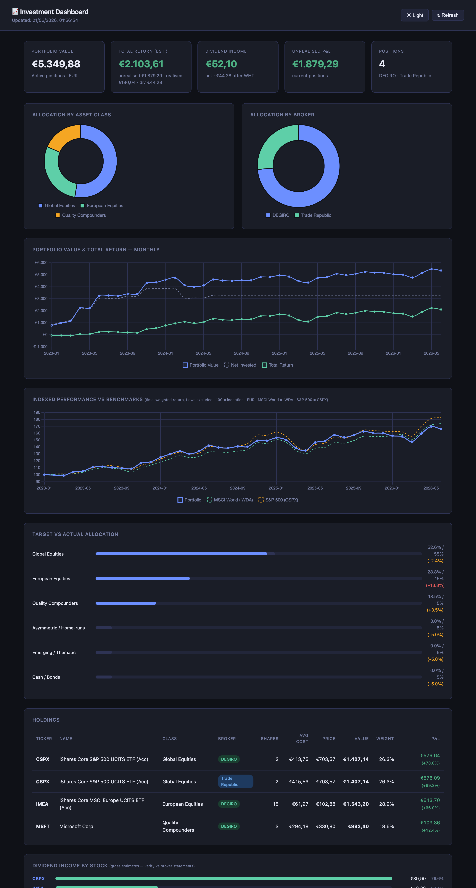

# 📈 investments-tracker

A personal investment research + portfolio tracking system you can fork and
run as your own. Features: ledger-driven portfolio dashboard (Chart.js +
GitHub Pages), automated daily refresh (GitHub Actions), benchmark comparison,
idea tracking with a buy-side analyst framework, and a pre-wired AI co-pilot
prompt (CLAUDE.md).

### **🔴 [Live demo dashboard →](https://ivanmilasevic.github.io/investments-tracker/)**  ·  **[Setup in 15 min →](SETUP.md)**

The live demo runs on **synthetic data** — it's the actual deployed dashboard,
safe to click around. Configurable base currency (EUR / USD / GBP / … — see
[below](#base-currency)).

[](https://ivanmilasevic.github.io/investments-tracker/)

---

## Structure

```
├── strategy/
│   ├── investment-philosophy.md   ← Core beliefs and principles
│   ├── asset-allocation.md        ← Target allocation + annual rebalancing log
│   └── checklist.md               ← Pre-buy / pre-sell decision checklist
│
├── ideas/
│   ├── _template.md               ← Copy this for each new idea
│   ├── watchlist.md               ← Quick overview of all ideas
│   └── [TICKER]-[name].md         ← Deep-dive per idea
│
├── portfolio/
│   ├── transactions.csv           ← SOURCE OF TRUTH: full trade/dividend ledger
│   ├── instruments.csv            ← SOURCE OF TRUTH: name, class, yf symbol, currency
│   ├── holdings_generated.csv     ← DERIVED snapshot (gitignored — never hand-edit)
│   └── nav_log.csv                ← Historical NAV series (appended by the script)
│
├── scripts/
│   ├── update_charts.py           ← Derive holdings from ledger, price, write dashboard
│   └── requirements.txt
│
└── docs/
    └── index.html                 ← Local HTML dashboard (open in browser)
```

---

## Brokers

| Broker | Use |
|--------|-----|
| [Your broker 1] | Core ETFs, DCA |
| [Your broker 2] | Individual stocks |
| [Your broker 3] | Index fund (bank) |

Configure your broker names in `portfolio/transactions.csv`. Any string is valid
as a broker name — the script tracks positions per (ticker, broker) pair.

---

## Workflow

### Adding a new idea
1. Copy `ideas/_template.md` → rename to `[TICKER]-[name].md`
2. Fill in the thesis, valuation, and risks
3. Add a row to `ideas/watchlist.md`

### After a trade
1. Add a row to `portfolio/transactions.csv` (the **only** position input)
2. If it's a new instrument, add a row to `portfolio/instruments.csv`
3. Run `python scripts/update_charts.py` — holdings, P&L and allocation are
   **derived** from the ledger. Never hand-edit holdings.

> The script refuses to publish if the ledger doesn't reconcile (e.g. selling
> more shares than were bought) — fix `transactions.csv` against your broker
> statements when that happens.

### Annual rebalance (January)
1. Run the update script to get current allocation
2. Open `strategy/asset-allocation.md` → compare Current vs Target
3. Plan trades to bring allocation back within bands
4. Execute and log in the Rebalancing Log table

### Viewing the dashboard
```bash
open docs/index.html   # macOS
# or just double-click docs/index.html
```

---

## Ideas tracked

See `ideas/watchlist.md` for the full list and `ideas/_template.md` to add your own.
One worked example: [MSFT — Microsoft](ideas/MSFT-microsoft.md).

---

## Base currency

The reporting currency is configurable — default **EUR**. Set the `BASE_CURRENCY`
env var (ISO code) and every figure, the dashboard symbol/locale, and FX
conversion follow:

```bash
BASE_CURRENCY=USD python scripts/update_charts.py    # report in USD
BASE_CURRENCY=GBP python scripts/update_charts.py    # report in GBP
```

How it works:
- Ledger columns `price` / `total` / `fee` (in `transactions.csv`) are
  denominated in your base currency. Record each trade's total the way it hit
  your account.
- Any instrument quoted in a **different** currency (its `currency` in
  `instruments.csv`) is auto-converted via yfinance FX — the script fetches
  whatever `<CUR><BASE>=X` pairs your holdings need, not just EUR/USD.
- Symbol + number formatting auto-resolve from the currency (override with
  `CURRENCY_SYMBOL` / `NUMBER_LOCALE`). The dashboard reads them from the
  generated data — no HTML edits required.

> Legacy ledgers using the old `price_eur` / `total_eur` / `fee_eur` headers
> still load unchanged (back-compatible reader).

---

## Setup

```bash
pip install -r scripts/requirements.txt
python scripts/update_charts.py
open docs/index.html
```
